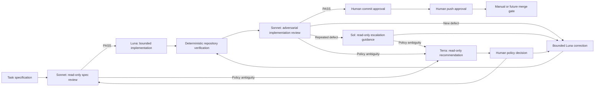

# Continuo

*Deterministic notation for probabilistic work.*

Continuo is an early-stage controller for coordinating specialized AI roles through bounded implementation, adversarial review, escalation, recovery, and human approval gates.

The engine is designed around a simple principle: **models do the probabilistic work; deterministic code controls the workflow**. Providers can implement, review, diagnose, and recommend, but they cannot decide their own authority, silently change roles, bypass correction limits, or publish repository changes.

> [!IMPORTANT]
> The current code is a working Jobs-specific reference implementation, not yet a project-agnostic framework. Repository conventions, provider commands, model names, and role labels are still hard-coded. The architecture deliberately documents these as implementation details to be replaced with role-based configuration and adapters.

For the complete behavioral reference and generalization roadmap, read [docs/ORCHESTRATION_ENGINE.md](docs/ORCHESTRATION_ENGINE.md).

## Why Continuo?

In musical performance, the continuo provides a persistent structural foundation while players realize their parts within the notation. That is the intended relationship between this controller and its model roles:

> **The notation constrains the improviser. The improviser cannot renegotiate the notation.**

The task specification and deterministic workflow form the score. Providers may interpret, implement, review, and diagnose within their assigned parts, but they cannot rewrite their authority, safety boundaries, escalation rules, or human approval gates.

## Why this exists

Multi-model workflows become difficult to trust when orchestration policy lives inside prompts. A model may retry indefinitely, broaden scope, substitute a different provider, infer missing policy, or perform a repository mutation that the operator never approved.

This controller moves those decisions into inspectable Python. It provides:

- one bounded task specification per run;
- clean-repository preflight and saved Git snapshots;
- separate implementation, review, escalation, and policy roles;
- stable finding identities and bounded correction loops;
- hard stops for policy ambiguity and provider/account failures;
- no automatic cross-provider fallback;
- recoverable, persisted workflow stages;
- working-tree fingerprints and resume guards;
- separate human approval for policy, commit, and push;
- provider attempt deadlines, process-group cleanup, timing, heartbeats, and audit records; and
- concise per-run reporting.

## Current status

The repository currently orchestrates tasks in a Jobs checkout using this convention:

```text
tasks/<task-ref>-*.md
```

For example, task `009` must resolve to exactly one file such as `tasks/009-example.md`. The controller persists the specification and its SHA-256, coordinates the run, and stores local run state under `runs/`.

The controller and its safety behavior are implemented and covered by 59 unit tests. The largest remaining gap is project-specific verification: current deterministic verification checks repository identity, changed files, and `git diff --check`, but it does not yet run a target project's tests, linter, type checker, or build.

## How it works



The Python controller owns every transition. A provider result is validated and recorded, then the controller—not the provider—decides the next stage.

## Roles and authority

| Role | Current route | Responsibility | Access |
|---|---|---|---|
| Human | Operator | Final policy, commit, push, and merge authority | Explicit confirmations; defaults to no |
| Deterministic controller | Python | Routing, stages, budgets, persistence, repository checks, Git gates, reporting | Owns workflow and Git operations |
| Terra | `gpt-5.6-terra` | Architecture and policy clarification | Read-only |
| Sol | `gpt-5.6-sol` | Persistent-defect diagnosis and bounded correction guidance | Read-only |
| Sonnet | Claude `sonnet` | Specification review and adversarial implementation QA | Read-only `Read,Glob,Grep` tools |
| Luna | `gpt-5.6-luna` | Initial implementation and corrections | Workspace write; no network; no Git authority |

A human-facing ChatGPT conversational orchestrator can sit above this engine to help plan and interpret work. That conversational layer is not currently invoked or persisted by the Python controller.

The names above are current routing details, not the intended permanent architecture. The future engine should route abstract roles such as `implementation`, `adversarial_review`, `escalation_executive`, and `policy_authority` through provider adapters and configuration.

## Correction and escalation policy

Sonnet returns a closed structured review result with a status, category, stable `finding_key`, and summary. The finding key lets the controller distinguish a genuinely new defect from the same defect surviving another correction.

For one persistent finding:

1. The first occurrence receives one ordinary bounded Luna correction.
2. The second consecutive occurrence receives Sol escalation round 1 and one Sol-guided correction.
3. The third consecutive occurrence receives Sol escalation round 2 and one final Sol-guided correction.
4. A fourth consecutive occurrence blocks the run for human attention.

A separate global budget permits at most 12 corrections across the entire run. This prevents a stream of different findings from cycling forever.

## Safety boundaries

### Repository safety

A new run requires:

- an existing Git repository root;
- a named branch rather than detached `HEAD`;
- a configured `origin`; and
- a clean working tree.

The controller snapshots repository path, branch, `HEAD`, and origin. After every implementation or correction, it verifies the snapshot, requires changed files, runs `git diff --check`, and records a working-tree fingerprint. Resume is refused if saved and current repository state diverge.

### Provider safety

- Sonnet, Terra, and Sol are invoked read-only.
- Luna receives workspace-write access with network disabled.
- Luna's prompt explicitly prohibits commit, push, branch changes, merge, rebase, reset, and `.git` mutation.
- Only the controller performs approved Git mutations.
- Invalid structured output receives one same-provider retry, then blocks.
- Provider failures use structured native errors, OS/supervisor outcomes, narrow
  stderr diagnostics, and only explicitly enabled bounded stdout tails; model
  prose, prompts, transcripts, and diffs are not transport evidence.
- Claude native error envelopes are separated from successful review content and
  never consume the invalid-content retry.
- Read-only provider unavailability receives two bounded same-provider retries,
  after 5 and 15 seconds. Workspace-write attempts are always single-shot.
- Read-only provider attempts have a 30-minute hard deadline; Luna writer attempts have a 60-minute deadline.
- Timeout or interruption terminates the isolated process group and preserves
  partial output. An uncertain writer result also persists pre/post repository
  evidence and blocks without automatic or ordinary-resume reinvocation.
- Quota, billing, authentication, rate-limit, configuration, and unclassified failures stop the current run immediately.
- Writer recovery is explicit: retry requires proof of exact restoration;
  adoption requires trustworthy current changes. Continuo never automatically
  resets, cleans, or discards partial changes.
- The controller never substitutes another provider automatically.

### Human gates

Policy approval, commit approval, and push approval are separate actions. All interactive confirmations default to no. A successful push ends at `pushed_awaiting_merge`; merge is not automated.

## Requirements

- Python 3.12 or newer
- [uv](https://docs.astral.sh/uv/)
- Git
- Authenticated `codex` CLI for the current Luna, Sol, and Terra routes
- Authenticated `claude` CLI for the current Sonnet route

Provider CLIs are not needed to run the unit tests because the tests use deterministic fakes and temporary Git repositories.

## Installation

```sh
git clone https://github.com/mbuckingham74/continuo.git
cd continuo
uv sync
```

Inspect the CLI:

```sh
uv run python orchestrator.py --help
```

The project currently installs an equivalent legacy entry point:

```sh
uv run jobs-orchestrator --help
```

The installed command retains its original Jobs-specific name until Continuo's package and configuration layers are generalized.

## Quick start

By default, the current implementation targets `~/Documents/my-apps/jobs`.

```sh
uv run python orchestrator.py run 009
```

Select a different checkout with `--repo`:

```sh
uv run python orchestrator.py run 009 --repo /path/to/jobs
```

Or set the current Jobs-specific environment variable:

```sh
export JOBS_REPO=/path/to/jobs
uv run python orchestrator.py run 009
```

The target repository must contain exactly one matching task specification, be clean, and have a named branch and `origin` remote.

## CLI commands

| Command | Purpose |
|---|---|
| `run <task-ref>` | Create and advance a new run until it reaches an approval gate or block |
| `resume <run-id>` | Safely continue from the saved stage without intentionally repeating completed provider work |
| `recover-writer <run-id>` | Explicitly retry an exactly restored writer state or adopt trustworthy current changes, with an audited note |
| `approve-policy <run-id>` | Record an explicit human policy decision and resume |
| `report <run-id>` | Show provider timing, failures, retries, corrections, decisions, review, and Git status |
| `status` | List the ten most recently updated local runs |
| `status <run-id>` | Print the complete persisted JSON for one run |

Examples:

```sh
uv run python orchestrator.py status
uv run python orchestrator.py status <run-id>
uv run python orchestrator.py report <run-id>
uv run python orchestrator.py resume <run-id>
uv run python orchestrator.py recover-writer <run-id> \
  --action retry-restored --note "Repository restored to the saved pre-attempt state."
uv run python orchestrator.py recover-writer <run-id> \
  --action adopt-current --note "Reviewed and reconciled the current partial changes."
uv run python orchestrator.py approve-policy <run-id> \
  --decision "Exact human-approved policy text."
```

## Persistence and privacy

Run state is written to ignored local files at `runs/<run-id>.json`. Each record can contain:

- the complete task specification;
- provider prompts, commands, stdout, and stderr;
- provider timing and failure classifications;
- provider capability and writer pre/post repository evidence;
- human policy decisions;
- explicit writer-recovery decisions and operator notes;
- repository fingerprints and verification results; and
- Git operation records.

These files are intentionally excluded from Git, but they may contain sensitive project context. Treat them as audit records, apply an appropriate retention policy, and do not publish them without review.

## Run reporting

The report command derives metrics from saved records, including:

- wall-clock run span;
- provider calls and recorded duration by role;
- provider failures and same-provider retries;
- correction count and distinct defect identities;
- Sol escalation and policy-decision counts;
- writer-recovery decision count and any pending writer-state block;
- final review status; and
- commit and push status.

Reporting is currently per-run. Cross-run reliability, cost, token use, throughput, and defect trends are roadmap items.

## Development

Install dependencies and run the suite:

```sh
uv sync
uv run python -m unittest -v
```

The 75 tests exercise temporary repositories, recorded sanitized fixtures, fake
providers, and real local child/grandchild processes. They cover preflight
safety, task resolution, correction budgets, repeat-finding escalation, policy
decisions, trusted failure-evidence precedence, Claude envelope/content
separation, capability-aware retry, writer pre/post snapshots, explicit
restoration/adoption, crash recovery, provider-stop resume behavior, bounded
process cleanup, timeout/interruption output, sandbox command construction,
reporting, Git approval defaults, and adversarial Git change parsing,
fingerprinting, persistence, recovery, and staging behavior.

Before committing changes, also check the diff:

```sh
git diff --check
```

## Repository layout

```text
.
├── orchestrator.py                 # Deterministic controller and CLI
├── providers.py                    # Provider commands, execution, retries, parsing
├── models.py                       # Persisted run and audit models
├── test_orchestrator.py            # Isolated controller test suite
├── docs/
│   └── ORCHESTRATION_ENGINE.md     # Full architecture and roadmap
├── src/jobs_orchestrator/
│   └── __init__.py                 # Installed CLI entry point
├── pyproject.toml
└── uv.lock
```

## Known limitations

- The implementation is coupled to Jobs task paths and repository defaults.
- Provider/model IDs, CLI commands, labels, retry values, and recovery maps are hard-coded.
- Verification does not yet run project-specific tests, builds, or acceptance checks.
- Workflow stages are strings rather than a typed, declared transition graph.
- Provider deadline values and termination grace are provisional hard-coded safety ceilings rather than configuration-backed policy.
- Provider error classification still has provider-specific diagnostic-pattern
  debt where a structured native error contract is unavailable; stdout-tail
  classification is disabled unless a recorded provider contract enables it.
- Run JSON is local and mutable rather than a tamper-evident event log.
- There is no run scheduler, concurrent-run lock, shared provider circuit breaker, or cross-run reporting.
- Pull requests, merge, rollback, deployment, and notifications are outside the current engine.

## Roadmap

The generalization path centers on preserving the existing safety invariants while extracting hard-coded details:

- role-based provider and model selection so route changes do not alter orchestration policy;
- provider adapters with normalized errors and structured-output contracts;
- machine-checkable provider capability profiles;
- project and repository adapters;
- task-spec adapters for local files, issue trackers, or structured sources;
- deterministic verification plugins;
- configurable, versioned escalation policy;
- a typed state machine and append-only event log;
- durable persistence, locking, redaction, and schema migrations; and
- reporting across runs, projects, providers, and model generations.

See the [validated stabilization and enhancement roadmap](docs/ENGINE_ROADMAP.md) for triaged priorities and corrected sequencing. The [full architecture roadmap](docs/ORCHESTRATION_ENGINE.md#22-future-generalization-architecture) describes the broader proposed abstractions and invariants.

Implementation progress and the gated transition from the Jobs compatibility profile to a reusable engine are tracked in the [Continuo execution plan](docs/EXECUTION_PLAN.md).

## Guiding invariants

As the engine becomes reusable, these properties should remain non-negotiable:

- workflow policy stays deterministic and inspectable;
- model identity remains separate from role authority;
- writers do not gain Git authority implicitly;
- reviewers and advisers remain read-only;
- policy recommendations require human approval;
- commit, push, and merge remain separate gates;
- provider failure never silently changes roles;
- retries and correction loops remain bounded and audited;
- repository state is verified before resume or publication; and
- consequential transitions persist enough context to explain what happened.

The reusable product is defined by these invariants—not by today's Jobs path or model names.
