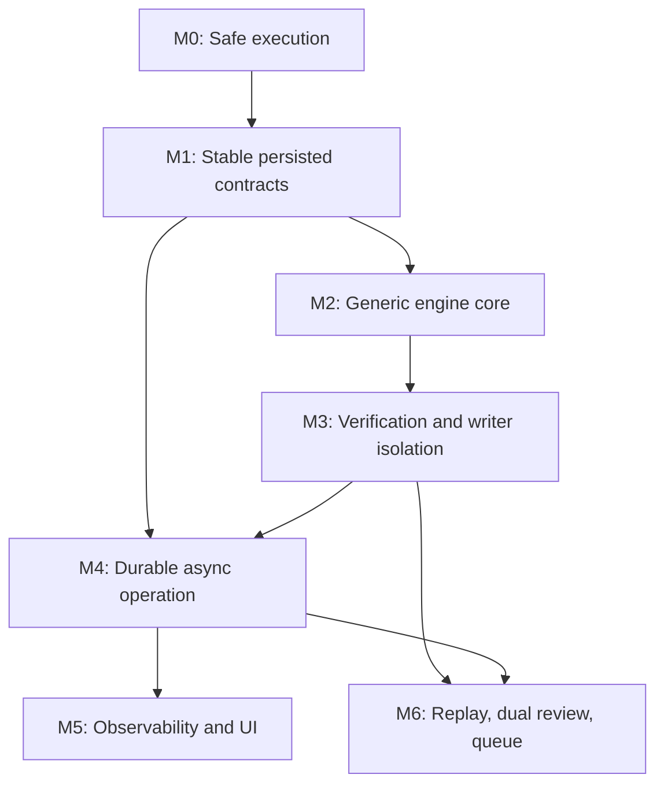

# Continuo stabilization and enhancement roadmap

## Status and scope

- **Status:** validated planning baseline
- **Review date:** 2026-08-01
- **Product name:** Continuo
- **Tagline:** *Deterministic notation for probabilistic work.*
- **Implementation authorized:** no

This document organizes two external analyses against the current repository and records which recommendations are accepted, revised, deferred, rejected, or still need evidence. It is the decision layer between raw ideas and implementation tickets.

Execution progress is tracked in [EXECUTION_PLAN.md](EXECUTION_PLAN.md). This roadmap remains authoritative; the tracker translates its priorities and dependencies into review gates and must be reconciled if the two documents diverge.

Preserved source material:

- [Critical-fixes intake](planning/2026-08-01-critical-fixes-intake.md)
- [Enhancements intake](planning/2026-08-01-enhancements-intake.md)

The intake files are evidence, not requirements. When they conflict with the current source or this document, this document controls planning.

Continuo is now the public product identity and repository name. Existing package, import, environment-variable, and CLI identifiers remain compatibility names until the generic-core migration gives them explicit aliases and a safe transition path.

## 1. Executive assessment

The central architectural diagnosis is correct: this repository is closer to a small durable workflow controller than to a chat-agent framework. Its most valuable properties are deterministic transitions, persisted provider boundaries, bounded correction policy, repository fingerprints, and explicit human authority.

The proposed work also contains several strong recommendations:

- supervise provider processes with real deadlines and process-group cleanup;
- replace display labels with stable role identities;
- persist parsed control records instead of rebuilding them from raw output;
- add schema migration before changing the persisted model further;
- add deterministic verification plugins and allowed-path enforcement;
- make approvals asynchronous and auditable;
- separate model/provider routing from orchestration policy; and
- introduce project, repository, task-spec, and provider adapters.

However, the imported sequencing is too event-log- and UI-centric for the engine's current maturity. Correctness, safe writer recovery, persistence contracts, and project abstraction should precede a full UI or queue. A full event-sourced rewrite is an architectural option, not an automatic prerequisite.

Three important corrections change the roadmap:

1. A queue cannot yield a target-repository lock at an approval gate when that checkout contains the run's uncommitted changes. Queueing needs isolated workspaces or Git worktrees first.
2. Automatic retry/resume is materially different for read-only and write-capable roles. Luna may leave partial changes after a failed attempt, so its invocation cannot safely be retried like a reviewer.
3. The current engine has two provider families—Codex and Claude—not three vendors. A second reviewer must be a separately configured reviewer role, not an opportunistic reuse of the policy-authority role.

## 2. Decision vocabulary

| Decision | Meaning |
|---|---|
| **Accept** | The problem and general remedy are supported by current evidence |
| **Revise** | The problem is real, but the stated impact, solution, or sequencing needs correction |
| **Validate** | The code exposes the risk, but a provider/runtime fixture or security experiment is required before choosing a fix |
| **Defer** | Potentially valuable, but dependencies or current value do not justify scheduling it yet |
| **Reject** | Not a current defect or conflicts with an engine invariant |

Priority means:

| Priority | Scheduling rule |
|---|---|
| **P0** | Complete before another unattended or consequential live writer run |
| **P1** | Complete before generalization or major feature development |
| **P2** | Build after the stable generic core exists |
| **P3** | Optional optimization or interface work driven by observed need |

## 3. Evidence collected during validation

The review used the complete current source, all 19 tests, both architecture documents, local CLI help, isolated temporary Git repositories, and the five local persisted run records.

Key observations:

- `changed_files()` does misparse Git-quoted Unicode names and names containing ` -> `.
- In the reproduced special-filename case, the controller omitted untracked contents from review/fingerprinting, but `git add` returned 128 instead of silently making a partial commit.
- Provider subprocesses have heartbeats but no overall deadline or cancellation cleanup.
- Failure classification scans full stdout and stderr and accepts bare numeric/string matches that can occur in code or diffs.
- The local Claude CLI supports `--allowedTools`, JSON output, and JSON Schema, but its current help does not expose the proposed `--max-turns` option.
- Codex supports JSONL event output, but the current provider command does not request it.
- Provider history and metrics depend on labels such as `Sonnet 5 High` and `Luna High`.
- Review history is reconstructed from raw provider stdout under `except Exception: continue`.
- Both documented CLI entry points currently work; the two-import-world issue is packaging debt, not an active entry-point failure.
- Three of five legacy/local run JSON files fail current `load_run()` validation.
- Local run JSON files currently have mode `0644` and can contain complete prompts and provider output.
- The macOS environment does not provide a `flock` command.
- The controller already runs `_resume_guard()` before approval processing and again after a positive commit/push decision, so it can detect an intervening fingerprint change. It does not record who approved, when they approved, or the exact gate decision.

## 4. Critical-fix triage

### C-1 — Git porcelain parsing

- **Decision:** Accept with corrected impact
- **Priority:** P0

Use NUL-delimited porcelain output and test Unicode, spaces, quotes, rename/copy records, and literal ` -> ` names. The current parser can hide untracked content from the reviewer and fingerprint. The reproduced commit step failed loudly, so “silently publishes wrong work” is not established for that case; review blindness and unreliable fingerprints are sufficient reasons to fix it immediately.

The implementation must verify Git's `-z` rename/copy field ordering rather than copy an untested parser.

### C-2 — Provider timeout and child cleanup

- **Decision:** Accept
- **Priority:** P0

Add a shared process supervisor with:

- explicit per-operation deadline;
- process-group isolation;
- TERM grace period followed by KILL;
- cleanup on cancellation and `KeyboardInterrupt`;
- captured partial output;
- a distinct timeout failure kind and blocked stage; and
- tests using real child processes, not only mocked `subprocess.run`.

A timeout must not automatically retry a write-capable operation. Suggested timeout values from the intake are hypotheses and should become configuration defaults only after real duration data is reviewed.

### C-3 — Failure classification scans model content

- **Decision:** Accept; revise the proposed regex
- **Priority:** P0

Full model transcripts and diffs are not a trustworthy transport-error channel. Prefer, in order:

1. provider-native structured error fields;
2. subprocess/OS error types;
3. narrowly matched stderr; and
4. a bounded stdout tail only when the provider contract requires it.

The intake's example HTTP regex still makes the `HTTP`/`status` prefix optional and therefore continues to match bare line numbers. Do not use it unchanged. Record classification source and raw provider-native error code when available.

### C-4 — Claude error envelopes

- **Decision:** Validate, then accept the parser split
- **Priority:** P0/P1 boundary

The current parser does treat a successful-process envelope without `structured_output` as malformed review output and consumes the structured-output retry. Add recorded fixtures for actual success, provider error, max-turn/limit error, and schema failure envelopes from the installed Claude CLI before locking the contract.

Transport/envelope failure must be distinct from invalid review content. `--allowedTools` is available locally and should be evaluated. The proposed `--max-turns` switch is not present in the installed CLI help and must not be planned as an available flag without another supported mechanism.

### C-5 — Display labels as control identifiers

- **Decision:** Accept
- **Priority:** P1, before any model/route rename

Add stable role and provider/route identifiers. Human-readable labels remain presentation only. History, recovery, metrics, and policy must use stable IDs.

Do not make one `Role` enum carry every concept. At minimum distinguish:

- orchestration role (`implementation`, `adversarial_review`, and so on);
- provider family/adapter (`codex_cli`, `claude_cli`);
- configured route ID; and
- display label/model metadata.

This avoids replacing one load-bearing string with another overloaded identifier.

### C-6 — Re-parsing raw review stdout for control state

- **Decision:** Accept
- **Priority:** P1

Persist an immutable parsed review record at the moment validation succeeds, linked to the raw provider attempt. Finding streaks and escalation decisions must use parsed records. Legacy fallback parsing may exist during migration, but unreadable records must be visible in status/reporting and must never silently disappear from policy calculations.

### C-7 — Unbounded diff and untracked content

- **Decision:** Accept
- **Priority:** P1

Introduce explicit input budgets, binary detection, efficient tracked/untracked membership, and recorded omission metadata. The current implementation does not truncate; it can instead construct an oversized prompt or consume excessive memory. Once limits exist, a reviewer must never PASS an incompletely presented change set.

The safest initial policy is to block with a precise `diff_too_large`/`review_input_incomplete` state and show remediation. Later designs may support chunked or artifact-based review.

### C-8 — `.git` metadata protection

- **Decision:** Validate and harden in layers
- **Priority:** P1

The command configuration and prompt clearly prohibit Git mutation, but the repository does not prove what the installed sandbox structurally protects. Run a separate, harmless sandbox capability test before claiming `.git` is writable or protected.

Independent of that result:

- snapshot relevant Git configuration, index, hooks, and exclusion state around writer calls;
- run controller commits with an explicitly controlled hooks policy;
- reject repository-local configuration that expands executable behavior unexpectedly; and
- prefer disposable worktrees/clones for stronger writer isolation.

`git commit --no-verify` alone is not a complete defense and may conflict with a project's required hook policy.

### C-9 — Correction bound and schema migration

- **Decision:** Accept with corrected claim
- **Priority:** P1, before adding persisted fields

Remove the fixed `le=12` persistence constraint and persist the resolved correction/escalation policy with the run. Add explicit schema migrations and stop stamping every save with the newest version without first migrating.

Adding a new field with a default does not inherently invalidate every old Pydantic record. Renames, removed fields, new required fields, stricter validation, and legacy incomplete files do. The local evidence is already sufficient: three of five existing records fail current loading.

Decide whether historical pre-production fixtures should be migrated, archived, or explicitly marked unsupported rather than promising all of them can resume.

### C-10 — Untrusted inter-model text in writer prompts

- **Decision:** Accept as defense in depth
- **Priority:** P2

Task specifications are authoritative user input; reviewer summaries and Sol guidance are untrusted data. Separate them visibly, cap their size, prefer typed fields, and instruct the writer that they cannot expand scope or authority.

Delimiters do not create a structural security boundary. The real controls remain role permissions, scope checks, verification, and controller-owned transitions. Add matching Pydantic length constraints rather than relying only on the provider-facing JSON Schema.

## 5. Quick-hit triage

| ID | Decision | Priority | Planning outcome |
|---|---|---:|---|
| Q-1: two import worlds | Revise | P2 | Both CLIs work. Consolidate under `src/orchestration_engine/` during the compatibility rename; keep a thin root shim temporarily. |
| Q-2: no run lock | Accept | P0 | Use a Python/SQLite/file-lock abstraction keyed by canonical target identity. Do not prescribe unavailable `flock`. Define stale-owner and crash behavior. |
| Q-3: approvals not recorded | Accept | P1 | Add immutable approval requests/decisions with gate, identity, timestamp, decision, and requested/approved fingerprints. Existing resume guards remain. |
| Q-4: brittle Git record slicing | Accept | P2 | Pass the logical Git argv explicitly into the recorder. |
| Q-5: import-time default repo | Defer | P3 | Resolve target selection through future configuration; not a meaningful current failure. |
| Q-6: run-record confidentiality | Accept and elevate | P0 | Create the run directory privately, write files mode `0600`, define retention/redaction/export policy, and test permissions. Existing files are currently `0644`. |
| Q-7: logical calls vs attempts | Accept | P2 | Report logical invocations and physical attempts separately. |
| Q-8: verification metric name | Accept | P2 | Rename the current proxy before adding real verification execution records. |

## 6. Additional findings from this review

### A-1 — Write-capable retries and resume are not side-effect safe

**Priority:** P0

The provider runner automatically retries every command classified as unavailable, including Luna. A failed initial Luna invocation may have modified the working tree before returning nonzero. The current blocked-provider resume path can invoke the same writer prompt again without first proving that the failed attempt left no partial changes; an initial implementation has no post-write fingerprint yet.

Required policy:

- retry rules depend on role capabilities, not only failure kind;
- read-only roles may use bounded automatic retry;
- write-capable roles do not automatically retry unless they run in an isolated/disposable workspace or an idempotency contract exists;
- record a pre-attempt repository fingerprint for every writer call;
- after failure/timeout/cancellation, compare state and block explicitly if partial changes exist; and
- make recovery a deliberate reconcile/discard/adopt decision rather than blind reinvocation.

This should be designed with C-2 and C-3 because all three meet at the provider execution boundary.

### A-2 — Queueing requires workspace isolation

**Priority:** P1 dependency for E-8

An approval-pending run normally leaves uncommitted changes in its checkout. Releasing only a process lock does not make that checkout safe for another task. A queue must either:

- keep one task active per checkout until its changes are resolved; or
- assign each run an isolated Git worktree/clone and publish reviewed changes through a controlled integration step.

Do not schedule `enqueue`/`worker` until this ownership model is explicit.

### A-3 — Target configuration will become executable policy

**Priority:** P1 dependency for E-5/E-9

A target-repository `orchestration.toml` that defines commands is executable policy. Snapshotting and hashing it is necessary but not sufficient. The design must specify:

- who is allowed to author/approve it;
- whether Luna may modify it during a run;
- which environment variables and network capabilities plugins receive;
- how command paths are resolved;
- how secrets are passed without persistence; and
- how a config change invalidates resume.

Protect the configuration file from writer scope or load it from a separately trusted control plane.

## 7. Enhancement triage

### E-1 — Append-only event log

- **Decision:** Revise
- **Priority:** P1 architectural decision; implementation no earlier than Milestone 4

An immutable audit journal and stable event contracts are valuable. A full event-sourced rewrite is not “nearly free” and is not required for `--json`, a richer terminal view, or a first asynchronous gate. It introduces dual-write/transaction questions, fold-version compatibility, payload schema evolution, compaction, redaction, and recovery semantics.

Write an architecture decision record comparing:

1. improved atomic snapshots plus append-only audit events;
2. SQLite as transactional current state plus events; and
3. events as the sole source of truth with materialized JSON views.

Hash chaining detects modification only when hashes are anchored or signed outside the same mutable store; it does not provide strong tamper evidence “for free.”

### E-2 — User interfaces

**Decision:** Split by tier

| Tier | Decision | Priority | Outcome |
|---|---|---:|---|
| `--json` CLI contracts | Accept | P1 | Stable machine output for `status`, `report`, and non-interactive transition results. Version the schema. |
| Rich live view | Accept | P2 | Extend existing start/finish/heartbeat output after event/state contracts stabilize. |
| Rust configuration TUI | Accept | P1 | Deliver a local setup workbench before the first project pilot. It must use the controller-owned versioned configuration commands and must not write trusted configuration, credentials, or run state directly. |
| Full operational TUI | Defer | P3 | Reassess run monitoring and asynchronous approvals after command/event boundaries stabilize. |
| Local web UI | Defer | P3 | Justified mainly by remote/phone approvals; requires authentication, CSRF protection, binding policy, and a safe writer API. |

### E-3 — Asynchronous approval gates

- **Decision:** Accept
- **Priority:** P2 after ApprovalRecord, locking, and state migration

This is a high-value usability improvement. The current controller already persists gate stages and rechecks repository state before executing Git. The redesign should add explicit request/decision records, identity, expiry/revocation, requested fingerprint, decision fingerprint, and a clean process exit at the gate.

An approval API must call the controller through a single-writer service or durable command queue. A UI must not write run files directly.

### E-4 — Cost and token telemetry

- **Decision:** Validate per adapter, then accept
- **Priority:** P2

Capture provider-native telemetry without requiring parity. Preserve a raw normalized usage record plus adapter version. Confirm real Claude and Codex fixtures before defining fields. Cost-per-defect is an analytical estimate, not an exact causal measure, and should be labeled accordingly.

### E-5 — Verification plugins and deterministic scope

- **Decision:** Accept
- **Priority:** P1/P2; highest quality feature

This is the strongest enhancement proposal. Build it after the process supervisor and trusted configuration contract. Persist each plugin result and feed evidence to the reviewer.

Revise one behavior: a failed deterministic check cannot simply enter the existing correction loop unless it becomes a typed finding with stable identity, budget semantics, and correction evidence. Define `VerificationFinding` or a unified `Finding` model first.

The initial plugin set should be generic capability types, not hard-coded `npm` assumptions. A project config may instantiate tests, type checking, lint, build, and allowed-path verification.

### E-6 — Dual-reviewer mode

- **Decision:** Defer and revise
- **Priority:** P3

Potentially useful for high-risk tasks, but it is not a roughly 50-line change. It affects provider routing, recovery, persisted reviews, finding identity reconciliation, disagreement policy, reporting, cost limits, and tests.

Do not use `policy_authority_model` as an implicit second reviewer. Configure two independent reviewer routes with equivalent read-only capabilities. Human review on disagreement is a sound default; finding merge rules still need design.

### E-7 — Replay

- **Decision:** Revise
- **Priority:** P3 after stable events/config/workspace artifacts

Split the concept:

- **Cassette/controller replay:** feed recorded normalized provider results into controller logic to test transition compatibility.
- **Historical re-evaluation:** call a new model against captured inputs and compare outputs; this is not offline deterministic replay.

Faithful replay requires policy/config versions, immutable parsed results, stage events, repository/diff artifacts, side-effect stubs, and versioned parsers. Raw prompts and stdout make it feasible, not nearly free.

### E-8 — Queue, worker, and circuit breaker

**Decision:** Split

- **Target lock:** Accept as P0 safety.
- **Shared provider circuit breaker:** Accept as P2 after normalized failures and shared storage.
- **Queue/worker:** Defer to P3 after per-run workspace isolation and async gates.

A provider account failure may be shared across roles using one account but not necessarily every route/provider. Circuit-breaker keys and reset/override policy must reflect provider, account/profile, region when relevant, role capability, and failure kind.

### E-9 — De-hardcoding

- **Decision:** Accept; move earlier
- **Priority:** P1/P2

The dependency order is directionally correct, but generalization should not wait until after UI, replay, dual review, and queueing. The engine's stated product direction is reusable orchestration, so config/adapters must shape those features.

Recommended order:

1. stable role/provider/route IDs and schema migration;
2. versioned resolved policy/config persisted per run;
3. provider adapter interface and normalized result/error types;
4. provider/model/effort catalogs, stable provider-account profiles, and explicit role-route/account selection;
5. provider capability profiles with startup enforcement;
6. repository/project and task-spec adapters;
7. compatibility renames and deprecated aliases.

Prefer `ORCHESTRATION_TARGET_REPO` over ambiguous `ORCHESTRATOR_REPO`. Keep `JOBS_REPO` and `jobs-orchestrator` as deprecated aliases for a defined transition period.

### E-10 — Smaller wins

| Item | Decision | Priority | Planning outcome |
|---|---|---:|---|
| Task-spec adapter | Accept | P1 | Move into the generic-core milestone, not the leftovers list. |
| Acceptance criteria | Accept | P1/P2 | Add to normalized task envelope; distinguish deterministic checks from reviewer checklist items. |
| Dry-run/plan mode | Accept | P1 | Must be read-only and explicit about whether spec review invokes a paid provider. |
| `doctor` command | Accept | P1 | Adapter-driven checks for binaries, auth, route capabilities, config, target state, and storage permissions. Never print secrets. |
| Structured log sink | Accept | P2 | Can precede full event sourcing; define a stable redacted schema. |
| Run cost ceiling | Accept after telemetry | P2 | Enforce between calls and disclose that an in-flight call can exceed the ceiling. |

### E-11 — Provider and model picker

- **Decision:** Accept and elevate
- **Priority:** P1, delivered in the generic-core milestone

The engine needs an explicit provider/model selection layer so a model retirement, provider change, or preferred-model update does not require controller edits. The picker is the operator-facing surface; the underlying requirement is a stable role-routing system.

Keep these concepts separate:

- **role:** the orchestration responsibility, such as `implementation` or `policy_authority`;
- **provider adapter:** the execution integration, such as a Codex CLI or Claude CLI adapter;
- **model ID:** the provider-specific model identifier;
- **route profile:** provider, model, sandbox/tool policy, effort, timeout, and structured-output settings for one role; and
- **display name:** human-readable text with no control-flow meaning.

Selection should be available through versioned configuration and controller-owned
CLI commands. A Rust TUI must consume those same versioned command contracts and
must not introduce another routing, configuration-writing, credential, or policy
mechanism. The initial TUI is a local configuration workbench; operational run
monitoring and remote approvals remain later work.

Required behavior:

1. List configured provider adapters and their locally supported/discovered models where reliable discovery exists.
2. Let the operator assign one validated route profile to each required role.
3. Reject a selection whose declared capabilities do not satisfy the role or exceed its permission ceiling.
4. Support global defaults, project configuration, and explicit run-time overrides with a documented precedence order.
5. Resolve the complete routing table at run creation, hash it, and persist it with the run.
6. Keep a resumed run pinned to its saved routes unless a human performs a separate, audited route migration.
7. Make `doctor` detect missing adapters, unavailable models, expired authentication, and incomplete role assignments before provider work begins.
8. Preserve deprecated provider/model aliases only in the configuration-migration layer, never in workflow policy.

Before implementing the picker, amend the route and resolved-configuration
contracts to make effort and provider-account identity explicit. Effort is a
provider/model-specific, closed route-profile field and is persisted in the
route hash; unsupported routes expose no synthetic effort value. A resolved
role binding identifies a stable non-secret provider-account profile in addition
to its complete registered route so resume cannot silently change account,
organization, endpoint, or quota scope.

Provider-account management is part of the pre-pilot setup surface. Account
metadata and secret material remain separate. API keys are accepted only through
a non-echoing controller command channel and stored in an OS credential store,
initially macOS Keychain; there is no plaintext fallback. CLI-managed login may
be referenced and inspected without copying its credential. Configuration,
resolved run state, route catalogs, logs, prompts, process arguments, and machine
output contain only stable account/profile references and bounded redacted
status. Offline inspection remains the default; an authentication/connectivity
probe is a separate explicit network action and must disclose whether it can
incur provider work or cost.

Provider/model selection does not authorize automatic fallback. If a selected model disappears during a run, the run blocks with a configuration/provider-availability reason. A human may update future defaults or approve an audited route migration; the controller must not silently substitute another model.

Initial configuration shape, for design discussion only:

```toml
[routes.implementation]
route_id = "builtin.implementation.high.v1"
provider_account_id = "provider-account:codex:primary"

[routes.adversarial_review]
route_id = "builtin.adversarial-review.standard.v1"
provider_account_id = "provider-account:claude:primary"
```

The complete registered route profile owns provider adapter, model, supported
effort, capability, and invocation policy. The non-secret account profile owns
the provider account/endpoint identity while credential material remains in the
adapter-managed credential store. The workflow refers only to the abstract role
and its resolved route/account binding.

## 8. Recommended milestone roadmap

### Milestone 0 — Safe execution before the next consequential writer run

1. **M0.1:** Correct NUL-delimited Git change parsing and special-path tests (C-1).
2. **M0.2:** Add provider deadlines, cancellation, and process-group cleanup (C-2).
3. **M0.3:** Normalize failure sources and Claude envelope errors with recorded fixtures (C-3/C-4).
4. **M0.4:** Make retry/recovery capability-aware; block partial writer changes (A-1).
5. **M0.5:** Add one-active-run target locking with tested crash behavior (Q-2).
6. **M0.6:** Make run storage private by default and define safe legacy-file handling (Q-6).

Exit criteria:

- no write-capable provider is automatically repeated after an uncertain partial attempt;
- all child processes have bounded lifetimes and cleanup tests;
- special filenames remain reviewable, fingerprinted, and stageable;
- a second controller cannot write to the same target concurrently; and
- new audit records are not group/world readable.

### Milestone 1 — Stable persisted contracts

1. Add explicit migrations and current-schema constants; classify legacy records (C-9).
2. Add stable role/provider/route IDs and remove labels from control flow (C-5).
3. Persist immutable parsed review records and surface unreadable legacy history (C-6).
4. Persist resolved correction/escalation policy per run.
5. Add approval request/decision records (Q-3).
6. Correct call/attempt and verification metric semantics (Q-7/Q-8).
7. Add versioned `--json`, `doctor`, and dry-run interfaces.
8. Decide the event/state architecture in an ADR; do not begin a full rewrite implicitly.

Exit criteria:

- a display/model rename cannot change correction or escalation behavior;
- a run resumes under the policy/config it started with;
- schema changes have migration and rollback tests;
- every control-relevant review is stored in parsed form; and
- human and machine clients have versioned read contracts.

### Milestone 2 — Generic engine core

1. Define and validate a versioned configuration file.
2. Add provider adapters and normalized invocation results.
3. Add provider/model/effort catalogs and the configuration-backed CLI picker (E-11).
4. Add stable provider-account profiles and controller-owned credential-store integration without persisting secrets.
5. Add machine-checkable capability profiles and least-authority validation.
6. Persist the resolved role-routing and provider-account bindings plus the configuration hash with each run.
7. Extract the current Git behavior behind a repository/project adapter.
8. Extract local Markdown behind a task-spec adapter and normalized task envelope.
9. Add acceptance-criteria representation.
10. Consolidate the package under `src/orchestration_engine/`.
11. Introduce `orchestration-engine` and `ORCHESTRATION_TARGET_REPO` with compatibility aliases.
12. Deliver the Rust configuration TUI over the versioned controller command boundary and prove CLI/TUI configuration equivalence before a project pilot.

Exit criteria:

- changing a model or provider route requires configuration, not controller-policy edits;
- every required role has an explicit, capability-valid route selected before a run starts;
- every selected role is bound to an available non-secret provider-account identity and an adapter-supported effort value or explicit unsupported state;
- run resume uses the exact persisted routing table rather than newly changed defaults;
- a non-Jobs project can supply a task and repository policy through adapters;
- config is validated, hashed, persisted, and protected from writer modification; and
- the Rust TUI and non-interactive CLI resolve identical canonical configuration and neither exposes or directly persists credential material; and
- role capability violations fail at startup.

### Milestone 3 — Deterministic quality and isolated writers

1. Build the shared safe command runner for verification plugins.
2. Add typed verification results/findings and correction-loop semantics.
3. Add test/build/lint/typecheck plugin instances through configuration.
4. Add deterministic allowed-path enforcement.
5. Add diff/input budgets, binary handling, and explicit incomplete-review blocks (C-7).
6. Validate and harden Git metadata boundaries (C-8).
7. Add disposable worktree/clone execution for write-capable roles.
8. Fence and constrain untrusted inter-model data (C-10).

Exit criteria:

- project checks run before probabilistic review where policy says they should;
- incomplete evidence cannot produce PASS;
- scope violations can be blocked deterministically; and
- a failed writer cannot contaminate another run or the controller's integration checkout.

### Milestone 4 — Durable asynchronous operation

1. Implement the chosen event/audit storage architecture (E-1 decision).
2. Make approval gates asynchronous and process-independent.
3. Add safe notification hooks.
4. Add redacted structured logs.
5. Add shared provider/account circuit breakers.

Exit criteria:

- the controller can exit cleanly at a gate and resume from an independently recorded decision;
- approval identity, time, decision, and fingerprints are auditable;
- only one writer mutates state; and
- provider account failures prevent redundant starts without hiding manual override state.

### Milestone 5 — Observability and operator interface

1. Capture normalized usage/cost telemetry per provider adapter.
2. Add cost ceilings and role-based cross-run reports.
3. Improve the Rich live view.
4. Reassess a full operational TUI versus authenticated local web UI using actual operator needs and experience from the configuration TUI.
5. Build operational UI features only on versioned read/command APIs.

### Milestone 6 — Advanced leverage

1. Cassette/controller replay and compatibility testing.
2. Historical model re-evaluation as a separate tool.
3. Opt-in dual-reviewer policy for high-risk tasks.
4. Queue/worker on isolated per-run workspaces.
5. Cross-project scheduling and reporting.

## 9. Dependency map



UI design can be explored earlier, but implementation should not define the storage model. Likewise, config-schema design can begin during Milestone 1, but adapters should not land before stable role and migration contracts.

## 10. Planning rules for future tickets

Every implementation ticket derived from this roadmap should include:

- the invariant being protected;
- current evidence or a reproducible failure;
- in-scope and out-of-scope behavior;
- persisted-schema impact and migration plan;
- read-only versus write-capable side effects;
- timeout, cancellation, retry, and idempotency behavior;
- crash/resume behavior at each new boundary;
- audit and redaction requirements;
- compatibility expectations for existing run files and CLI names;
- deterministic tests, including failure paths; and
- explicit documentation updates.

Avoid effort estimates such as “about an hour,” “roughly 50 lines,” or “a weekend” until the ticket's persistence, recovery, and compatibility surface is defined.

## 11. Open decisions requiring design work

These questions should become ADRs or time-boxed spikes, not implicit implementation choices:

1. Snapshot-plus-events, transactional state-plus-events, or full event sourcing?
2. What exact recovery options exist after a writer leaves partial changes?
3. Is a disposable Git worktree sufficient isolation, or is an external sandbox/clone required?
4. Which target configuration is trusted, and who may change it?
5. How are identities established for local, API, and remote approval decisions?
6. Which provider-native envelope fields are stable enough to normalize?
7. Which historical run files must remain loadable or replayable?
8. What constitutes one provider account for a cross-run circuit breaker?
9. Which verification failures can trigger automatic correction, and how are they assigned stable identity?
10. Does the first UI need remote/phone access, or is asynchronous CLI/TUI approval sufficient?
11. Can each provider adapter reliably discover available models, or must catalogs be configured and refreshed explicitly?
12. What is the precedence among user defaults, project routes, task risk profiles, and per-run provider/model overrides?
13. Under what conditions, if any, may a blocked run migrate to a different route without invalidating its audit and review assumptions?

## 12. Explicitly deferred or rejected assumptions

- No automatic cross-provider fallback is planned. Capability profiles do not imply substitution authority.
- No UI will write run JSON directly.
- No queue will reuse a dirty approval-pending checkout for another task.
- No policy-authority route will double as a second reviewer merely because a model is available.
- No silently truncated diff can receive review PASS.
- No full event-sourcing rewrite is approved by this roadmap alone.
- No model/provider rename occurs before stable role IDs and migrations.
- No provider/model picker may silently change the persisted routes of an existing run.
- No implementation work is included in this documentation-ingestion change.

## 13. Next planning action

Review and approve [EXECUTION_PLAN.md](EXECUTION_PLAN.md), then convert Milestone 0 into six bounded task specifications, starting with M0.1 and M0.2 but designing M0.2–M0.4 together around one provider-attempt lifecycle. Each task should receive an adversarial test plan before implementation begins.

After Milestone 0 is specified, decide whether the next planning session focuses on the persistence-contract ADR (Milestone 1) or the first generic configuration schema (Milestone 2). Do not begin UI or queue implementation first.
